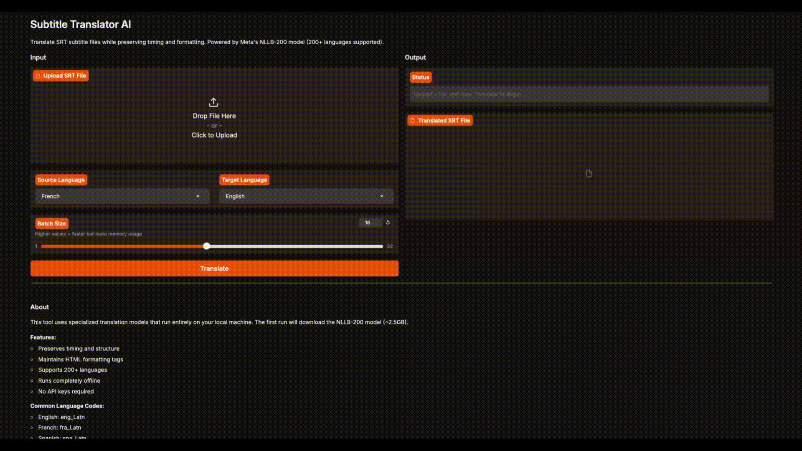

<div align="center">

# Subtitle Translator AI

<p align="center">
  <a href="https://www.python.org/downloads/"></a>
  <a href="https://pytorch.org/"></a>
  <a href="https://huggingface.co/docs/transformers/"></a>
  <a href="https://docs.pydantic.dev/"></a>
  <a href="https://www.gradio.app/"></a>
  <a href="https://huggingface.co/facebook/nllb-200-distilled-600M"></a>
</p>

AI-powered subtitle translation that runs entirely on your machine. Transform .srt files across 200+ languages while preserving timing and formatting. Features a web interface, CLI, and Python API.

</div>

<div align="center">



  <p><em>See how the user can easily translate video editor subtitles just with few clicks</em></p>

</div>

## 📖 Overview

This tool translates SRT subtitle files while preserving timing, formatting, and structure. It uses specialized translation models that run entirely on your local machine, providing consistent and reliable outputs without the unpredictability of general-purpose LLMs.

### Motivation

I use DaVinci Resolve to automatically generate subtitles. It does a great job with timing and segmentation, but it doesn't translate between languages. I tried ChatGPT and other LLMs, but long videos create extremely long contexts; chunking them naïvely often leads to hallucinations, mixed languages, or lost formatting.

This tool uses smaller, specialized translation models ([facebook/nllb-200-distilled-600M](https://huggingface.co/facebook/nllb-200-distilled-600M)) that are purpose-built for translation tasks, resulting in more consistent and reliable outputs for long-form content.

## 📋 Table of Contents

- [📖 Overview](#-overview)
- [✨ Features](#-features)
- [🚀 Installation](#-installation)
- [💻 Usage](#-usage)
- [⚙️ Configuration](#️-configuration)
- [📁 Project Structure](#-project-structure)
- [🏗️ Architecture](#️-architecture)
- [🔧 Troubleshooting](#-troubleshooting)
- [🤝 Contributing](#-contributing)

## ✨ Features

This project keeps the SRT file as the source of truth:

- **Preserves Structure**: Parses SRT blocks with Pydantic and maintains index/timing integrity
- **HTML Tag Support**: Keeps basic HTML tags that are comprehensible by software (e.g., DaVinci Resolve)
- **200+ Languages**: Uses Hugging Face NLP model for many language pairs (fra_Latn → eng_Latn by default)
- **Triple Interface**: Web UI (Gradio), CLI, and Python API for flexible integration
- **Local Processing**: No API keys required, runs entirely offline
- **Batch Processing**: Efficient translation with progress tracking using tqdm

The result is a reliable, repeatable translation pipeline that works well on long files without drifting context or breaking your editor workflow.

## 🚀 Installation

### Requirements

- Python 3.9 or higher
- ~2.5GB disk space for the model (downloaded on first run)

### Editable Install (Development)

```bash
python3 -m venv .venv
source .venv/bin/activate
pip install -U pip
pip install -e .
```

### Install from PyPI (Coming Soon)

```bash
pip install subtitle-translator-ai
```

**Note**: The first run will download the NLLB-200 model; expect a large download (~2.5GB) and some warm-up time.

## 💻 Usage

### Web Interface (Gradio)

Launch the interactive web interface with an orange-themed UI:

```bash
# Basic launch (opens at http://127.0.0.1:7860)
python run_gradio.py

# Create a public shareable link
python run_gradio.py --share

# Custom port
python run_gradio.py --port 8080
```

Or from Python:

```python
from subtitle_translator_ai import launch_app

launch_app()  # Opens in browser
launch_app(share=True)  # Creates public link
```

The web interface provides:

- Drag-and-drop file upload
- Language selection dropdowns (20 common languages)
- Adjustable batch size slider
- Real-time translation progress
- One-click download of translated files
- Custom orange theme

### CLI

Basic usage:

```bash
subtitle-translator sample.srt -o outputs/translated.srt --src-lang fra_Latn --tgt-lang eng_Latn
```

**Options**:

- `--src-lang`: Source language code (default: `fra_Latn`)
- `--tgt-lang`: Target language code (default: `eng_Latn`)
- `-o, --output`: Output file path

### Python API

```python
from subtitle_translator_ai import translate_srt, SubtitleBlock

# Translate a file
translate_srt(
   "sample.srt",
   "outputs/translated.srt",
   src_lang="fra_Latn",
   tgt_lang="eng_Latn",
)

# Parse and serialize a single block
block_text = """1
00:00:01,000 --> 00:00:03,500
<b>Bonjour! Bienvenue á Paris</b>
"""
sb = SubtitleBlock(block=block_text)
print(sb.index, sb.start_time, sb.end_time, sb.text)
print(sb.serialize())  # back to SRT block (with <b> tags preserved)
```

## ⚙️ Configuration

### Language Codes

The project uses NLLB-200 language codes. Common examples:

| Language              | Code       |
| --------------------- | ---------- |
| English               | `eng_Latn` |
| Spanish               | `spa_Latn` |
| French                | `fra_Latn` |
| German                | `deu_Latn` |
| Japanese              | `jpn_Jpan` |
| Korean                | `kor_Hang` |
| Chinese (Simplified)  | `zho_Hans` |
| Chinese (Traditional) | `zho_Hant` |
| Arabic                | `arb_Arab` |
| Russian               | `rus_Cyrl` |

For a complete list of supported languages, see the [NLLB-200 documentation](https://github.com/facebookresearch/flores/blob/main/flores200/README.md#languages-in-flores-200).

### Model Configuration

- **Default Model**: `facebook/nllb-200-distilled-600M`
- **Model Size**: ~2.5GB
- **Cache Location**: `~/.cache/huggingface/`
- **Batch Size**: Configurable in code (default handles long files efficiently)

## 📁 Project Structure

```
subtitle-translator-ai/
├── src/
│   └── subtitle_translator_ai/
│       ├── __init__.py          # Package exports
│       ├── api.py               # Python API interface
│       ├── cli.py               # CLI entry point
│       ├── gradio_app.py        # Gradio web interface
│       ├── srt_translator.py   # Core translation logic
│       └── utils.py             # Utility functions
├── assets/
│   └── logo.png                 # Project logo
├── outputs/                     # Translated output files
├── sample.srt                   # Example subtitle file
├── run.py                       # Quick start script
├── run_gradio.py               # Gradio launcher script
├── pyproject.toml              # Project configuration
└── README.md                    # This file
```

## 🏗️ Architecture

The translation pipeline follows these steps:

1. **Parse SRT File**: Read and parse the input SRT file into structured blocks using Pydantic models
2. **Extract Text**: Extract subtitle text while preserving HTML tags and timing metadata
3. **Batch Translation**: Send text to the NLLB-200 model in efficient batches with progress tracking
4. **Reconstruct Blocks**: Combine translated text with original timing and index data
5. **Write Output**: Serialize blocks back to valid SRT format

### Key Components

- **SubtitleBlock (Pydantic Model)**: Validates and structures each subtitle entry with index, timing, and text
- **SRT Translator**: Manages model loading, batch processing, and translation logic
- **HTML Tag Preservation**: Maintains formatting tags throughout the translation process
- **Progress Tracking**: Uses tqdm to display real-time translation progress

The system uses PyTorch and Transformers under the hood, with automatic GPU acceleration if available.

## 🔧 Troubleshooting

### Model Download Issues

**Problem**: Model download fails or times out

**Solution**:

```bash
# Manually download the model
python -c "from transformers import AutoTokenizer, AutoModelForSeq2SeqLM; AutoTokenizer.from_pretrained('facebook/nllb-200-distilled-600M'); AutoModelForSeq2SeqLM.from_pretrained('facebook/nllb-200-distilled-600M')"
```

### Memory Issues

**Problem**: Out of memory errors during translation

**Solution**:

- Reduce batch size in the code
- Use CPU instead of GPU for very large files
- Process files in smaller chunks

### Invalid SRT Format

**Problem**: Output SRT file has formatting issues

**Solution**:

- Ensure input SRT file is properly formatted
- Check for unusual characters in the source file
- Validate timing format (should be `HH:MM:SS,mmm --> HH:MM:SS,mmm`)

### Language Code Errors

**Problem**: `Language code not supported` error

**Solution**:

- Verify you're using NLLB-200 codes (e.g., `eng_Latn`, not `en`)
- Check the [complete language list](https://github.com/facebookresearch/flores/blob/main/flores200/README.md#languages-in-flores-200)

### Performance Issues

**Problem**: Translation is very slow

**Solution**:

- First run downloads the model - this is normal
- Subsequent runs should be faster
- GPU acceleration will improve speed significantly
- Consider using a smaller subset for testing

---

## 🤝 Contributing

Contributions are welcome! Please feel free to submit a Pull Request.

## Support

If you encounter any issues or have questions, please [open an issue](https://github.com/Akirachang/subtitle-translator-ai/issues) on GitHub.
